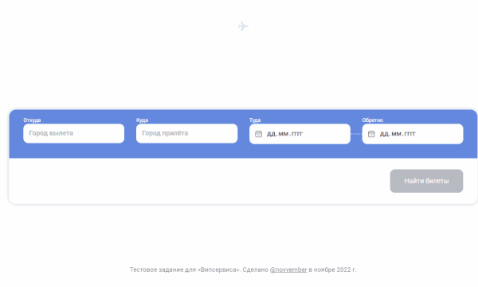

# Avia

Мини-приложение для поиска авиабилетов. Тестовое задание для "Випсервиса".

## 👀 Демо [`novvember.github.io/vipservice-avia`](http://novvember.github.io/test__vipservice-avia)

## Возможности

- Роутинг по страницам приложения
- Адаптивная верстка под десктопные и мобильные устройства
- Форма поиска
  - валидация
  - стилизованные стандартные инпуты
  - анимация во время выполнения запроса
  - параметры последнего поиска сохраняются при перезагрузке страницы
- Генерация билетов в зависимости от запроса (приближено к REST API)
- Результаты поиска
  - Поиск не выполняет запроса к настоящему API и сами билеты условные, но даты и города зависят от запроса
  - Форматирование данных о билетах: время, даты, цены, расчет длительности.
  - Разный формат вывода билетов:
    - простые билеты с одним рейсом выводятся просто так
    - сложные билеты с несколькими рейсами (например, туда-обратно) выводятся в несколько строк
    - однотипные билеты группируются в одну строку и их можно переключать через табы (такая группировка билетов происходит на условном сервере)

## Стек

- TypeScript
- Create React App
- React.js
- React Router
- Local Storage
- CSS keyframes
- Async/await
- БЭМ
- Без использования UI-библиотек

## Мои комментарии к выполненной работе

- В макете не было требований к вертске под мобильные — сделал адаптив по своему усмотрению.
- Добавил небольшие шапку и подвал для приложения.
- Добавил небольшие анимации и эффекты для формы и логотипа в шапке.
- Постарался сделать запрос к серверу похожим на настоящее API, в ответ на который приходит массив объектов с билетами.
- Сделал карточки по возможности максимально переиспользуемыми (опять же по своему усмотрению, потому что не совсем ясно, какие виды карточек существуют и какие возможности должны поддерживаться).
- Сделал дополнительные изменяемые данные по билетам: багаж, ручная кладь, возвратный/невозвратный.
- Всякие визуальные данные преобразуются и форматируются в приложении: время, даты, продолжительность полета, логотипы авиакомпаний.
- Коды аэропрортов заменил на условные и не изменял при разных запросах (такие данные все-таки должны приходить с сервера).

## Задание ([ссылка](https://docs.google.com/document/d/1qPSFoOCgQtqnYm0zLSQtNt7bH3Ok90_5XhDNlCN6WK4/edit#))

### [Макет](https://www.figma.com/file/zLxjSQiYoJ8c4lsOTzkdkU/%D0%A2%D0%97-%D0%BD%D0%B0-%D0%B2%D0%B0%D0%BA%D0%B0%D0%BD%D1%81%D0%B8%D1%8E-%D0%9F%D1%80%D0%BE%D0%B3%D1%80%D0%B0%D0%BC%D0%BC%D0%B8%D1%81%D1%82-%D0%BF%D0%BE%D0%BB%D1%8C%D0%B7%D0%BE%D0%B2%D0%B0%D1%82%D0%B5%D0%BB%D1%8C%D1%81%D0%BA%D0%B8%D1%85-%D0%B8%D0%BD%D1%82%D0%B5%D1%80%D1%84%D0%B5%D0%B9%D1%81%D0%BE%D0%B2?node-id=0%3A1)

### Основное задание

Необходимо написать приложение поиск авиабилетов с помощью React или Next.js. Для верстки используется макет

В приложении должно быть две страницы:

- Страница формы поиска - `/avia`
- Страница с карточкой перелёта - `/avia/info`

Для выполнения тестового задания Вы можете использовать UI-библиотеку компонентов (MUI, antd и т.д.).

Задание необходимо выполнить на **TypeScript**, без использования **any** и **ts-ignore**.

Для данного проекта не предусмотрено взаимодействие с сервером, поэтому все данные статичны и берутся из макета, **кроме** данных которые пользователь ввел в форму поиска(город, дата), они должны динамически отображаться в карточке рейса.

### Страница - форма поиска `/avia`

Сделать базовую валидацию полей для формы поиска.

- Откуда\* - текстовое поле
- Куда\* - текстовое поле
- Туда\* - текстовое поле
- Обратно - текстовое поле

  \* - обязательные поля

Если обязательных поля не заполнены или не проходят валидацию, кнопка “Найти билеты” находится в состоянии disabled.

После заполнения обязательных полей, пользователь может нажать кнопку “Найти билеты”, после чего пользователь должен быть перенаправлен на страницу /avia/info

### Страница - карточка перелёта `/avia/info`

В карточке перелёта город и дата вылета/прилёта должны содержать значения, которые пользователь ввел в форме поиска.

Пользователь может выбрать рейс с другим временем. При выборе времени, активное состояние должно измениться, также должно измениться основное время в рейсе.

Если в форме поиска было выбрано направление туда и обратно, то необходимо отобразить карточку с информацией о двух рейсах

### Отправка выполненной работы на проверку

Необходимо отправить письмо на почту s.markov@vipservice.ru с темой письма “Frontend - ФИО”, в теле письма, необходимо указать ссылку на **публичный профиль** GitHub/ GitLab, а также **ссылку на ваше резюме** с hh.ru.

## Статус разработки

✅ _Готово_
